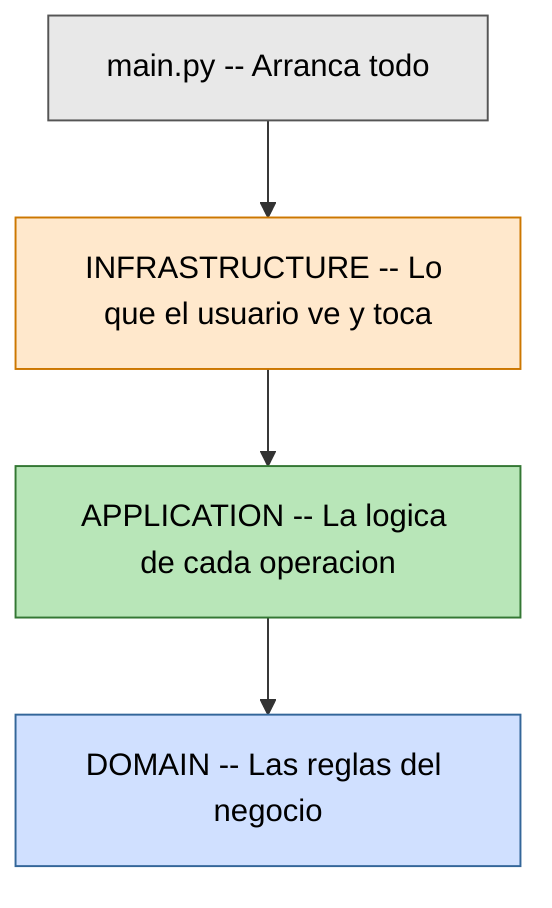
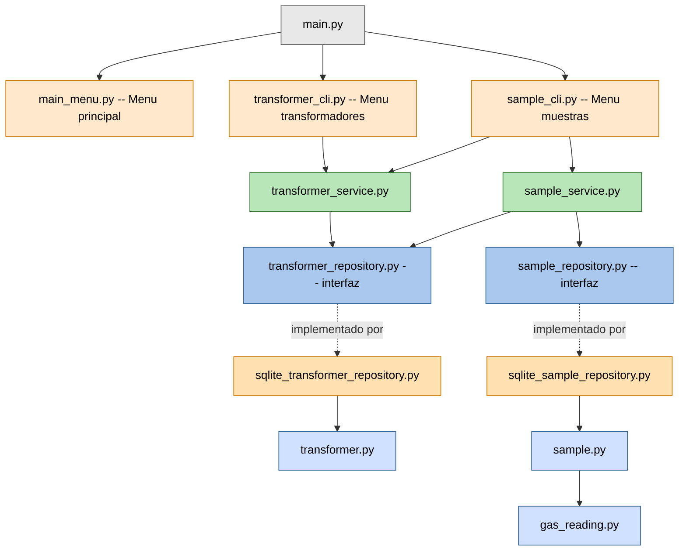

# Diagrama de Bloques -- Archivos .py del proyecto

## Nivel 1 -- Vista general (solo 3 capas)

Pensalo como un edificio de 3 pisos. Cada piso solo puede llamar al piso de abajo.



---

## Nivel 2 -- Cada archivo y a quien llama



---

## Como leerlo (paso a paso)

1. **main.py** abre los 3 menus (naranja).
2. Cada menu llama a su **servicio** (verde).
3. Cada servicio habla con una **interfaz** (azul con borde).
4. Esa interfaz la **implementa** un repositorio SQLite (naranja claro, flecha punteada).
5. Los repositorios crean los **modelos** (azul): transformer, sample, gas_reading.

---

## Ejemplo real: el usuario registra una muestra

```
El usuario escribe los datos de gases
         |
    sample_cli.py        (recibe lo que escribio)
         |
    sample_service.py    (valida y coordina)
         |
    sqlite_sample_repository.py   (guarda en la base de datos)
         |
    sample.py + gas_reading.py    (la estructura de los datos guardados)
```
