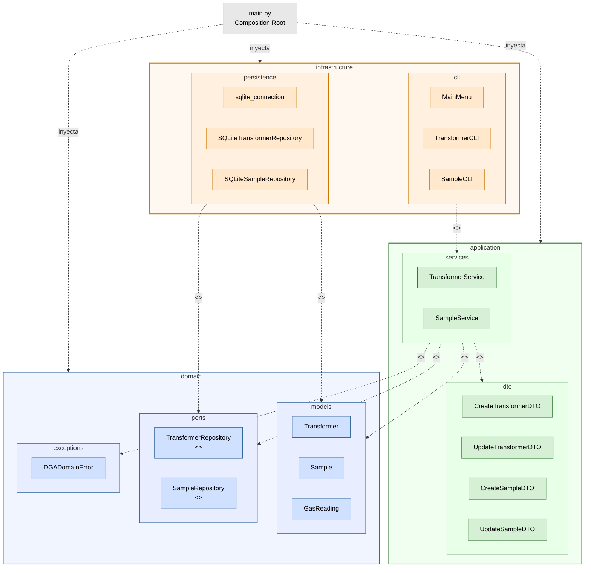

# Diagrama de Paquetes -- Arquitectura Hexagonal

Diagrama UML de paquetes del sistema DGA (Dissolved Gas Analysis).
Muestra la organizacion en capas y la direccion de las dependencias
siguiendo la arquitectura hexagonal (Ports & Adapters).

Las dependencias fluyen siempre de afuera hacia adentro:
infrastructure -> application -> domain.

## Leyenda

| Color    | Capa            | Descripcion                                             |
|----------|-----------------|---------------------------------------------------------|
| Azul     | domain          | Nucleo de negocio. No depende de nada externo.          |
| Verde    | application     | Casos de uso. Depende solo de domain.                   |
| Naranja  | infrastructure  | Adaptadores concretos. Depende de application y domain. |
| Gris     | main.py         | Composition Root. Conecta todas las capas.              |

## Estereotipos UML utilizados

| Estereotipo    | Significado                                                  |
|----------------|--------------------------------------------------------------|
| <<interface>>  | Contrato abstracto (ABC) sin implementacion.                 |
| <<use>>        | El paquete origen importa y utiliza elementos del destino.   |
| <<realize>>    | El paquete origen implementa las interfaces del destino.     |

## Regla de dependencia

Las flechas punteadas representan dependencias en codigo (sentencias
import). Todas fluyen de la capa exterior hacia la interior. Ninguna
capa interna conoce a las externas.
