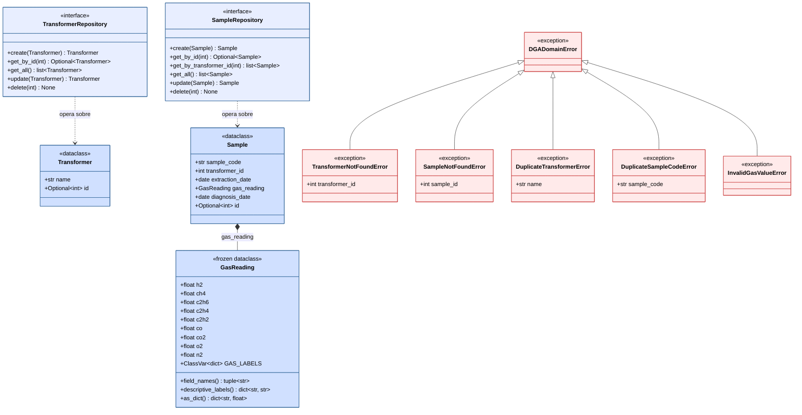

# Diagrama de Clases -- Capa Domain

Diagrama UML de clases de la capa domain del sistema DGA.
Contiene las entidades, value objects, puertos abstractos y
excepciones que conforman el nucleo de negocio.

Ninguna clase de este diagrama depende de capas externas.

## Leyenda

| Color       | Elemento                       | Descripcion                                    |
|-------------|--------------------------------|------------------------------------------------|
| Azul fuerte | Modelos (entidades / VO)       | Clases con datos e invariantes de negocio.     |
| Azul claro  | Puertos (interfaces)           | Contratos abstractos (ABC) sin implementacion. |
| Rojo claro  | Excepciones                    | Errores especificos del dominio.               |

## Relaciones UML utilizadas

| Simbolo                     | Tipo           | Significado                                         |
|-----------------------------|----------------|-----------------------------------------------------|
| Linea con rombo negro       | Composicion    | Sample posee y controla el ciclo de vida de GasReading. |
| Flecha punteada abierta     | Dependencia    | El puerto opera sobre la entidad indicada.          |
| Flecha con triangulo vacio  | Generalizacion | La subclase hereda de DGADomainError.               |

## Notas de diseno

- **GasReading** es un Value Object (frozen=True): inmutable, sin identidad,
  comparable por valor.
- **Transformer** y **Sample** son Entidades (frozen=False): mutables, con
  identidad (id) y validacion en `__post_init__`.
- Los puertos definen contratos CRUD puros. No contienen logica de negocio.
- Todas las excepciones heredan de **DGADomainError** para permitir captura
  centralizada en las capas superiores.
