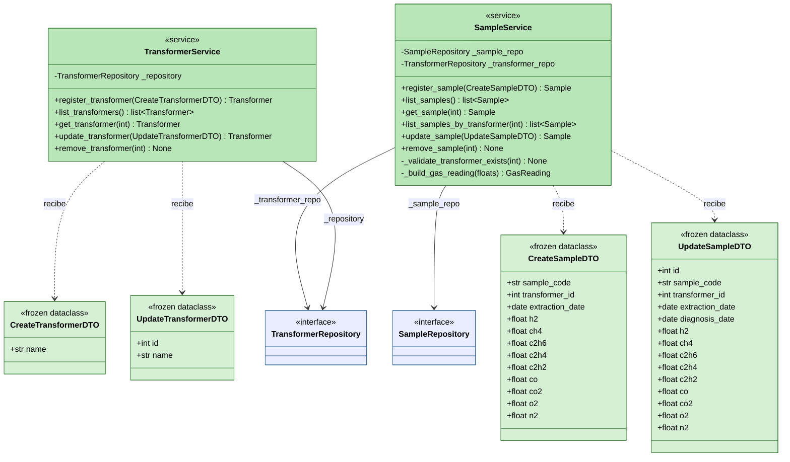

# Diagrama de Clases -- Capa Application

Diagrama UML de clases de la capa application del sistema DGA.
Contiene los DTOs (objetos de transferencia de datos) y los servicios
que orquestan los casos de uso CRUD.

Esta capa depende unicamente de domain (puertos, modelos, excepciones).
Nunca depende de infrastructure.

## Leyenda

| Color       | Elemento            | Descripcion                                              |
|-------------|---------------------|----------------------------------------------------------|
| Verde claro | DTOs                | Objetos inmutables de transferencia de datos.            |
| Verde medio | Servicios           | Orquestadores de casos de uso CRUD.                      |
| Azul claro  | Puertos (domain)    | Interfaces abstractas importadas desde la capa domain.   |

## Relaciones UML utilizadas

| Simbolo                    | Tipo          | Significado                                            |
|----------------------------|---------------|--------------------------------------------------------|
| Linea continua con flecha  | Asociacion    | El servicio mantiene una referencia al puerto.         |
| Flecha punteada abierta    | Dependencia   | El servicio recibe el DTO como parametro de metodo.    |

## Notas de diseno

- Los servicios reciben puertos abstractos por constructor (DIP), no
  implementaciones concretas. Esto permite sustituir SQLite por cualquier
  otro adaptador sin modificar esta capa.
- Los DTOs son inmutables (frozen=True). Actuan como barrera entre la
  interfaz de usuario y el dominio, absorbiendo cambios de UI.
- **CreateSampleDTO** no incluye `diagnosis_date` porque se asigna
  automaticamente con la fecha actual al crear la entidad.
- **UpdateSampleDTO** si incluye `diagnosis_date` porque el usuario
  puede modificarla en una actualizacion.
