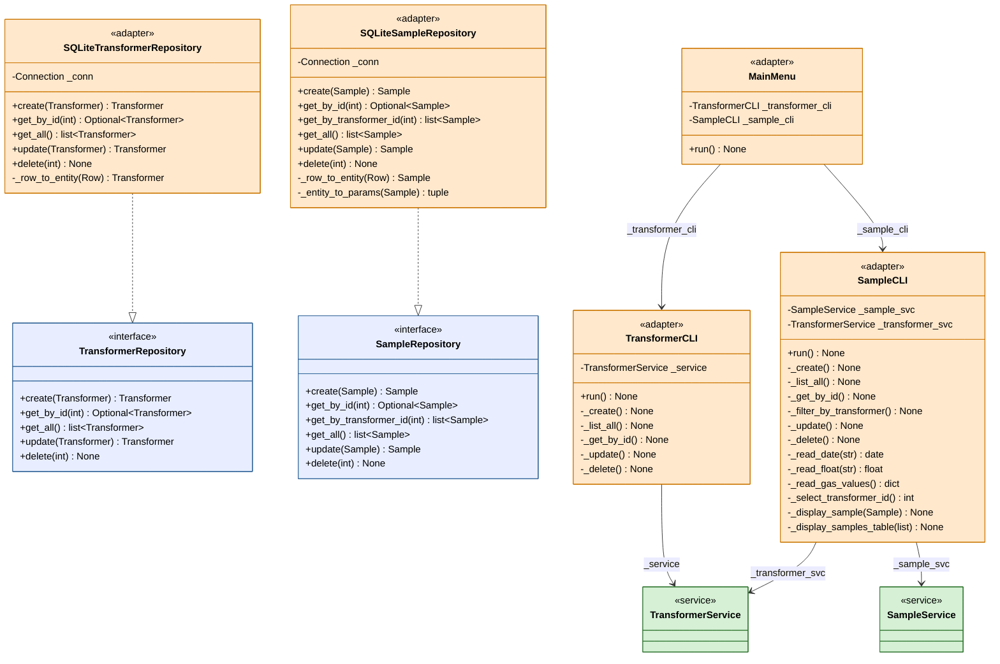

# Diagrama de Clases -- Capa Infrastructure

Diagrama UML de clases de la capa infrastructure del sistema DGA.
Contiene los adaptadores concretos: repositorios SQLite (salida) y
adaptadores CLI (entrada).

Cada adaptador implementa o consume contratos definidos en las capas
internas (domain y application), cumpliendo la regla de dependencia.

## Leyenda

| Color       | Elemento                 | Descripcion                                          |
|-------------|--------------------------|------------------------------------------------------|
| Naranja     | Adaptadores (infra)      | Clases concretas de persistencia y CLI.              |
| Azul claro  | Puertos (domain)         | Interfaces abstractas implementadas por los repos.   |
| Verde claro | Servicios (application)  | Clases consumidas por los adaptadores CLI.           |

## Relaciones UML utilizadas

| Simbolo                               | Tipo          | Significado                                           |
|----------------------------------------|---------------|-------------------------------------------------------|
| Linea punteada con triangulo vacio     | Realizacion   | El adaptador implementa la interfaz del puerto.       |
| Linea continua con flecha              | Asociacion    | El adaptador mantiene una referencia al componente.   |

## Notas de diseno

- Los repositorios SQLite implementan los puertos abstractos del dominio.
  Podrian sustituirse por PostgreSQL, MongoDB o un mock en memoria sin
  modificar ninguna otra capa.
- Los adaptadores CLI solo conocen servicios de aplicacion, nunca acceden
  directamente a repositorios ni a la base de datos.
- **MainMenu** coordina la navegacion entre **TransformerCLI** y **SampleCLI**
  sin conocer la logica de negocio.
- **SampleCLI** depende de dos servicios porque necesita listar transformadores
  disponibles al registrar o actualizar una muestra.
