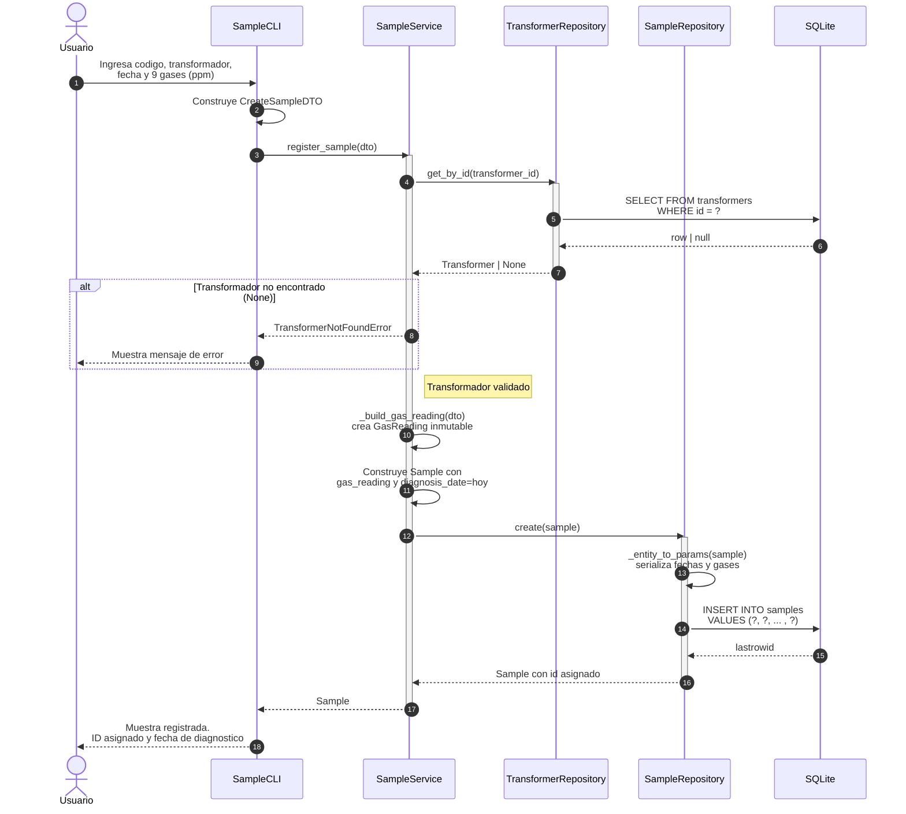

# Diagrama de Secuencia -- Registrar Muestra

Diagrama UML de secuencia que ilustra el flujo completo del caso de uso
"Registrar una nueva muestra de aceite" en el sistema DGA.

Muestra la interaccion entre las tres capas (infrastructure, application,
domain) y la base de datos SQLite, incluyendo el camino alternativo
cuando el transformador no existe.

## Participantes

| Participante          | Capa            | Responsabilidad                                   |
|-----------------------|-----------------|---------------------------------------------------|
| Usuario               | --              | Actor externo que interactua con la terminal.     |
| SampleCLI             | infrastructure  | Adaptador de entrada. Captura datos y los empaqueta en un DTO. |
| SampleService         | application     | Orquesta el caso de uso. Valida, construye entidades y delega. |
| TransformerRepository | domain (puerto) | Contrato abstracto. En runtime es SQLiteTransformerRepository. |
| SampleRepository      | domain (puerto) | Contrato abstracto. En runtime es SQLiteSampleRepository.      |
| SQLite                | infrastructure  | Base de datos fisica que almacena los registros.  |

## Mensajes clave

| Paso | Mensaje                        | Tipo         | Descripcion                                       |
|------|--------------------------------|--------------|----------------------------------------------------|
| 1    | Ingresa datos                  | Sincrono     | El usuario proporciona codigo, trafo, fecha y gases. |
| 2    | Construye DTO                  | Interno      | La CLI empaqueta los datos crudos en un DTO inmutable. |
| 3    | register_sample(dto)           | Sincrono     | La CLI delega al servicio de aplicacion.           |
| 4-7  | get_by_id -> SELECT            | Sincrono     | El servicio valida que el transformador exista.    |
| alt  | TransformerNotFoundError       | Excepcion    | Si el transformador no existe, se aborta el flujo. |
| 8    | _build_gas_reading             | Interno      | Se crea el Value Object GasReading inmutable.      |
| 9    | Construye Sample               | Interno      | Se ensambla la entidad con fecha de diagnostico = hoy. |
| 10-13| create -> INSERT               | Sincrono     | Se persiste la muestra y se obtiene el ID asignado. |
| 14-15| Respuesta al usuario           | Retorno      | Se muestra el resultado exitoso en la terminal.    |

## Notas de diseno

- El servicio llama a **TransformerRepository** (no a TransformerService)
  directamente, porque la validacion de existencia es una regla del caso
  de uso, no una operacion de UI.
- El **GasReading** se construye antes del **Sample** porque es un Value
  Object compuesto dentro de la entidad.
- La **diagnosis_date** no viene del usuario en la creacion; se asigna
  automaticamente con la fecha del sistema (`date.today()`).
- El fragmento **alt** muestra el camino de error. Si el transformador
  no existe, la excepcion sube hasta la CLI, que la captura y muestra
  el mensaje al usuario sin interrumpir el bucle del menu.
